# הנדסה לאחור של יישום MacOS 9

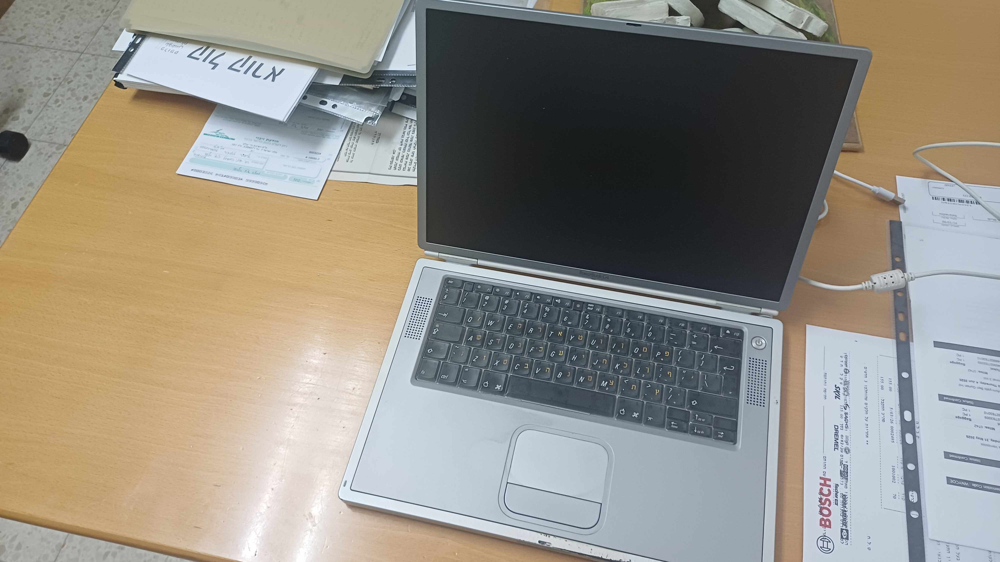

### הקדמה:

איך הפרוייקט הזה התחיל?

אבא שלי הוא אדם מאוד שמרן. ברגע שיש משהו שנוח לו, הוא לא יחליף אותו גם אם יש חלופות טובות בהרבה בחוץ. את עיקר המאמרים שלו הוא כותב על מחשב PowerBook G4 מסוף המאה הקודמת, באמצעות תוכנה ספציפית בשם NisusWriter 6.1.

אך אפשר לצפות שלא לעולם חוסן, ובמוקדם או במאוחר המחשב בן 25 השנים ישבוק חיים לכל חי. לכבוד יום-ההולדת של אבי, החלטתי לסדר עבורו אמולטור של מערכת ההפעלה הקלאסית שלו, עם כל התוכנות האהובות עליו, על המחשב המרכזי בבית. כך שהוא יוכל להמשיך באזור הנוחות שלו גם כשה-PowerBook ימות.

האמולטור שבחרתי הוא SheepShaver, אמולטור קוד פתוח שמיועד ספציפית ל-MacOS מהשנים ההן.

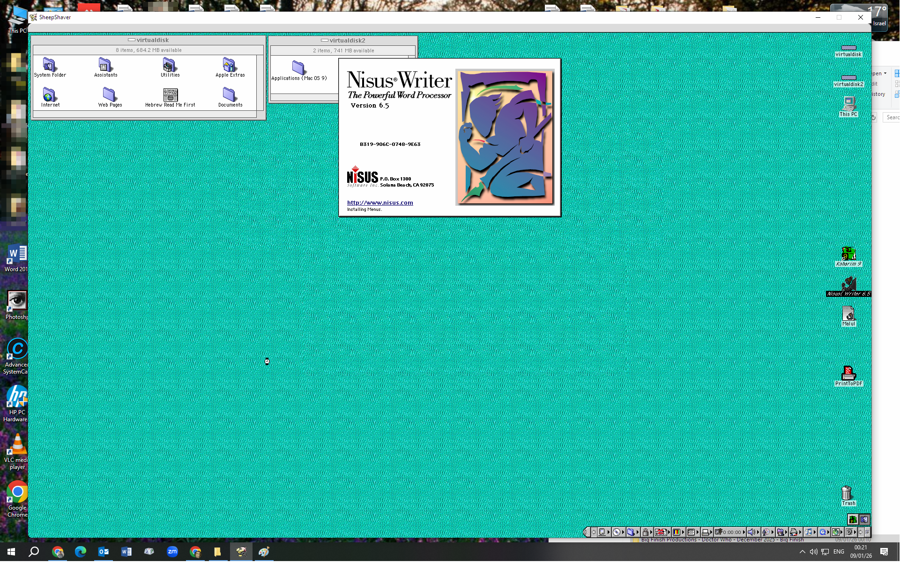

התקנתי את SheepShaver על המחשב הנייח הביתי, והתחלתי להתקין תוכנות בתוך האמולטור. הכל הלך פחות-או-יותר חלק. המקום הראשון שבו נתקלתי בבעיה רצינית היה עם תוכנה בשם "קשרים 9", שמטרתה להמיר קבצי NisusWriter ל-RTF, כך שאבי יוכל לשתף את מאמריו עם אנשים שאין ברשותם את התוכנה המיושנת שלו.

*קשרים* הינה תוכנה בתשלום. המשתמש היה מתקין את התוכנה על המחשב שלו, בהפעלה הראשונה היה קופץ מסך עם שני פריטים – קוד זיהוי, ומקום להכניס מפתח הפעלה. המשתמש היה שולח את קוד הזיהוי (הייחודי לכל מחשב, כפי שנרחיב בהמשך) לחברה, ואחרי שהיה משלם, הוא היה מקבל בחזרה מפתח הפעלה שמתאים למחשב הספציפי הזה.

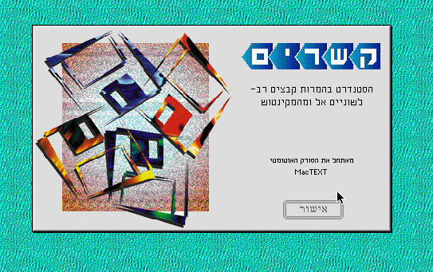

החברה שייצרה את קשרים כבר מזמן איננה. ה-snapshot האחרון של האתר שלה ב-Wayback Machine הוא מ-2006.

נשארתי תקוע ללא יכולת להשיג את קוד ההפעלה של התוכנה בדרך ישירה. בשלב זה החלטתי לפנות להנדסה-לאחור של *קשרים* בעזרת גידרה (Ghidra).

### בניית תוכנית

**השלב הראשון:** לבדוק האם מישהו עשה את העבודה בשבילי.

למרבה הצער חיפוש של קשרים ברחבי הרשת העלה אפס תוצאות בכיוון הזה.

**השלב השני:** ניסוח של המטרה.

מה בדיוק אני רוצה למצוא בחיטוט בקרביים של קשרים?

כמה אפשרויות:

א. לגלות מאיזה מאפיינים של המחשב מורכב ה-ID, ולראות האם אני יכול לשכפל אותם על האמולטור, ובכך לגרום לתוכנה לקבל את ה-Activation Key של המחשב הישן.

ב. לנסות למצוא איפה התוכנה מבצעת השוואה מעין:
```c
if(user_input_key == correct_key)
```
ולשנות את זה ל:
```c
if(user_input_key != correct_key)
```
כך שהתוכנה תקבל כל מפתח שהוא.

ג. השאפתנית מכולן: אם יהיה לי מזל, אולי אוכל לשכפל את האלגוריתם שאיתו התוכנה מרכיבה את המפתח הנכון, כך שאוכל ליצור מפתח עבור כל מחשב/אמולטור באשר הוא. למה זה תלוי במזל? האפשרות הזו תלויה מאוד עד כמה החברה השקיעה באבטחה.

מוצרי תוכנה גדולים משתמשים בהצפנה א-סימטרית (תחשבו על RSA) כדי ליצור מפתחות הפעלה. מבלי להיכנס לפרטים הטכניים, הצפנה סימטרית בדרך כלל תכיל את אלגוריתם יצירת המפתח בתוך התוכנה וכך תוודא את נכונות המפתח, בעוד שהצפנה א-סימטרית משתמשת במפתח ציבורי כדי לאמת את מפתח ההפעלה, אך יצירת המפתח אפשרית רק ע"י מפתח פרטי הנשמר אצל החברה. השאלה היא עד כמה השקיעו באבטחת "קשרים 9".

**מה ידוע לנו?**

**`PowerBook G4`:**
- `Id: QB110-667-00000-978`
- `Activation Key: 8767-2260-1172`

**`PowerBook G3`:** (מחשב ישן עוד יותר שכבר שבק חיים, אבל אבא שלי שמר את האימייל עם קוד האתחול)
- `Id: FX10C-916-00342-162`
- `Activation Key: 7887-2174-1455`

**`Emulator`:**
- `Id: QB10C-334-00220-765`

**קדימה מתחילים!**

נביט בעץ התיקייה של קשרים:

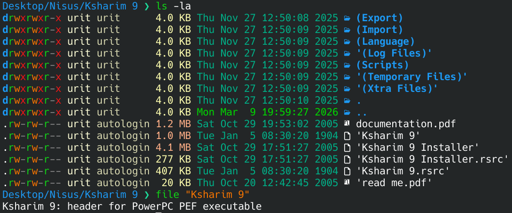

אותנו מעניין קובץ ההרצה המרכזי `Ksharim 9`.

מחשבי Apple באותה תקופה עבדו על מעבדים בארכיטקטורה `PowerPC-32`. למרבה המזל, ל-Ghidra יש תמיכה מעולה ב-`PowerPC-32`. הדבר היחיד שלא עבד חלק היה שהייתי צריך לבחור לבד את הווריאציה של המעבד. בחרתי את אחת האפשרויות באקראי וקיוויתי לטוב.

הדבר הכי חשוב ללמוד בממשק של Ghidra זה הניווט (Navigation). קובץ-ההרצה המרכזי של קשרים היה בגודל של 1.06 מ"ב. הקובץ הזעיר הזה הכיל מאות אלפי שורות אסמבלי (1,255,928 אם לדייק), ומאות פונקציות פסודו-C. מבלי לצמצם את תחום החיפוש, זה הולך להיות עבודה סיזיפית אינסופית.

כדי לצמצם את תחום החיפוש יש לפנינו שתי גישות פשוטות:

**א.** לחפש מחרוזות שידוע לנו שנמצאות בחלון הכניסה, ולעבוד משם אחורה לפונקציה שקראה להן. למרבה הצער, כל המחרוזות בחלון הכניסה היו בעברית, ו-Ghidra לא מצאה אפילו אות אחת בעברית בכל התוכנית (ההסבר הטכני המשוער לזה הוא ש-MacOS באותה תקופה השתמשה במערכת קבצים מיושנת בשם HFS+, שהייתה מאכסנת כל קובץ בשני קבצים 'אמיתיים' – `data` ו-`resources`, התוכנה עצמה 'גרה' ב-`data`, שאותו ניתחנו, בעוד שהטקסטים בעברית, יחד עם גרפיקה ועוד גרו ב-`resources`.)

**ב.** לחפש קריאות ל-API של מערכת ההפעלה, המבקשות מידע על המחשב. בעזרת ניתוח הקוד שקורא ל-API המיועד להשגת מידע על המחשב, נוכל להבין בעזרת אלו פרמטרים התוכנה יוצרת את ה-`Id`, וכך נוכל לנסות להתקדם עם הכיוון הראשון – לשטות בתוכנה שהאמולטור הוא המחשב שיש לנו את ה-Activation Key שלו.

קריאת-המערכת הנפוצה ביותר עבור קבלת מידע על המערכת היא `Gestalt`. התחביר שלה הוא:
```c
Gestalt(OSType selector, long *response);
```

במהלך החיפוש הראשוני, זיהיתי 62 קריאות ל-`Gestalt`, מתוכן 52 קריאות שונות מתוך `FUN_1002e8f8`. פונקציה זו תשאלה רשימה מקיפה של פרמטרים מערכתיים, החל מארכיטקטורת המעבד וסוג יחידת-הנקודה-הצפה (`FPU`), ועד לגרסאות של `QuickTime`, `Appearance Manager` ורכיבי מערכת אחרים. הפונקציה אוגרת את כל רכיבי המידע האלו במיקום ספציפי בזיכרון (שכונה ע"י גידרה `puVar3`), כך שקטעי קוד אחרים יוכלו להשתמש בהם.

אם אכן ה-`Id` מיוצר מ-`puVar3`, זה בשורה רעה מאוד! שינוי האמולטור כך שישקף בדיוק את כל המידע הזה זו משימה כמעט בלתי-אפשרית.

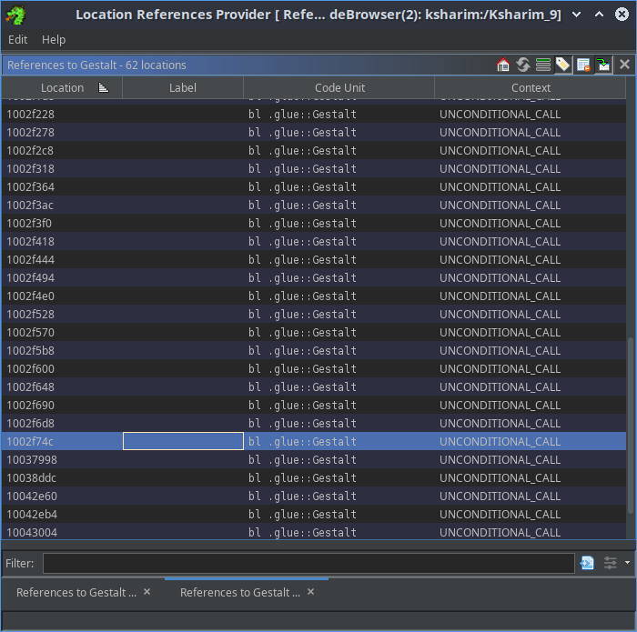

השלב הבא הוא למצוא את הפונקציות הקוראות ל-`FUN_1002e8f8`. גידרה מצאה ארבע פונקציות שקראו ישירות ל- `FUN_1002e8f8`.

א. ככל הנראה ה-`main`. כוללת הרבה קריאות לפונקציות אחרות, והפעלת רכיבים גרפיים. (ואכן, הפונקציה `entry` ב-`Symbol Tree` קוראת לפונקציה הזו.)

ב, ג, ו-ד. פונקציות שמתאחלות רכיבים גרפיים, ודברים שונים. אף אחת מהן אינה מייצרת-ה`Id` שאנו מחפשים.

איך זה יכול להיות? אפשרות אחת היא ש-`FUN_1002e8f8` נקראת בצורה לא-ישירה, עם `offset` למיקום אחר בקובץ-ההרצה, וגידרה לא זיהה את זה כקריאה ל-`FUN_1002e8f8`.

אפשרות אחרת היא ש-`FUN_1002e8f8` לא קשורה בכלל לתהליך ייצור ה-`Id` שאנו מחפשים, והיא נוצרה אוטומטית ע"י ה-`Framework` שאיתו קשרים נכתבה.

בשלב הזה, התחלתי "לשוטט" בפונקציות היוצאות מה-`main`, ולראות לאן זה מוביל אותי. התהליך הזה לקח זמן לא מועט, ודי איבדתי את הכיוון אחרי שרשראות ארוכות של פונקציות הקוראות לפונקציות אחרות. לא זו הדרך. צריך שיטה ממוקדת יותר.

התחלתי לעבור על קריאות מערכת אחרות, לראות אם אמצא משהו מעניין. ומשהו כזה אכן קרה: פונקציה שמבקשת מהמערכת את זמן יצירת הכונן הראשי של המחשב (באמצעות קריאת המערכת `PBXGetVolInfoSync`), שולפת את הדקות והשניות מהתאריך הזה, מכפילה אותם זה בזה ומחזירה את התוצאה. הנה הפונקציה המדוברת, אחרי קצת שיפוצים:

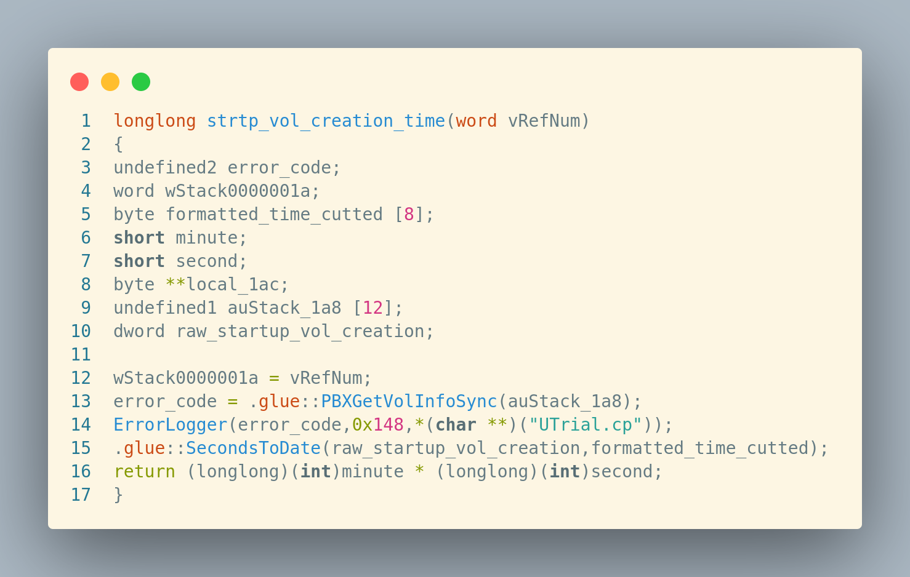

הקוד רחוק מאוד מלהיות מושלם, דבר המדגים את הצורך לעבוד יד ביד גם עם תצוגת האסמבלי.

המשתנה `formatted_time_cutted`, הוא `struct` בגודל של 14 בתים מטיפוס `DateTimeRec` המכיל שבע שדות, כ"א שני בתים (שנה, חודש, יום, שעה, דקה, שניה, יום בשבוע). פונקצית המערכת `SecondsToDate` מקבלת את תאריך יצירת הכונן הגולמי בשניות, ומחזירה אותו ל-`struct` המסודר. כאשר מתוך ה-`struct` רק שני השדות האחרונים באים לידי שימוש.

גידרה מאפשרת לנו לערוך את סוגי משתנים וליצור סוגים חדשים בהתאם לצורך, בהמשך נדגים זאת במקום אחר.

בכל מקרה, זו כבר התקדמות! הקוד הזה הוא 100% חלק מיצירת ה-`Id` של המחשב. אין סיבה אחרת לבצע פעולה כזאת.

במאמר המוסגר: זו חתיכת שיטה לא מוצלחת לזהות מחשב ספציפי. מה יקרה אם המשתמש ישדרג את הכונן הקשיח? הוא יצטרך לשלם שוב על התוכנה? (אכן, במדריך השימוש שהגיע עם קשרים נכתב "אנו ממליצים לרשום את קוד ההפעלה ולשומרו. קוד זה מתאים למחשב אחד בלבד ולא ישתנה *כל עוד לא נעשו שינויי חומרה במחשב*.")

בחזרה לעבודה: בעזרת ה-`Xrefs`, מצאנו בקלות מיהי הפונקציה הקוראת ל-`strtp_vol_creation_time`. אחרי סקירה מהירה שלה, אפשר בהחלט לקבוע שהיא הפונקציה שאחראית לייצור ה-`Id` של המחשב.

הנה חתיכה מעניינת (וקטנה יחסית) מהפונקציה:

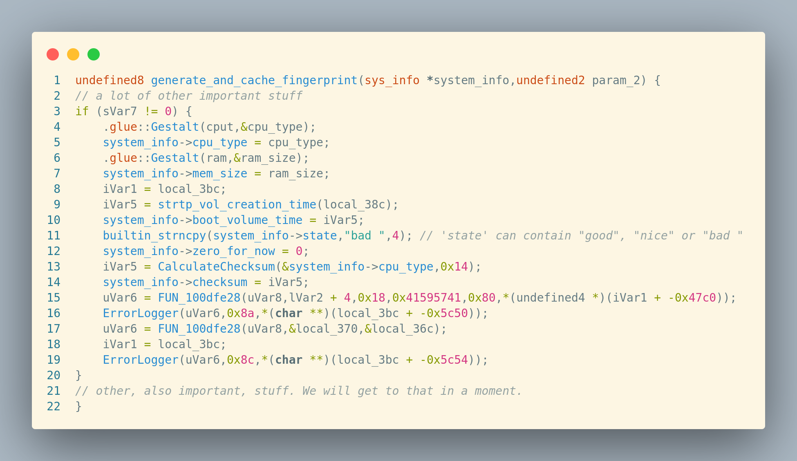

מה אפשר לראות כאן?

קודם כל, שמות הפונקציות והמשתנים הם עבודה ידנית מא' ועד ת'. גם זיהוי סוג המשתנה זו עבודה שגידרה עדיין לא ממש מוצלחת בה. לכן, גידרה מאפשרת לנו לערוך את סוג המשתנים, וגם ליצור משתנים חדשים אם אנחנו חושדים שיש `struct`-ים שגידרה לא זיהתה. שימו לב שהפונקציה מקבלת `struct` מסוג `sys_info`, שלתוכו היא מכניסה נתונים על המערכת. את ה-`struct` הזה יצרתי עם קצת ניחושים מושכלים לפי ערכי ההחזרה של הפונקציות הנקראות.

(כדי ליצור `data type` חדש, צריך לנווט ל-`window`, לבחור `data type manager`, לבחור את הקטגוריה שבה אנחנו רוצים לשמור את ה-`data type` החדש, מקש ימני -> `new`, יש כמה אפשרויות – לבחור `structure`. ויפתח חלון שבו נוכל להגדיר את ה-`struct` החדש.

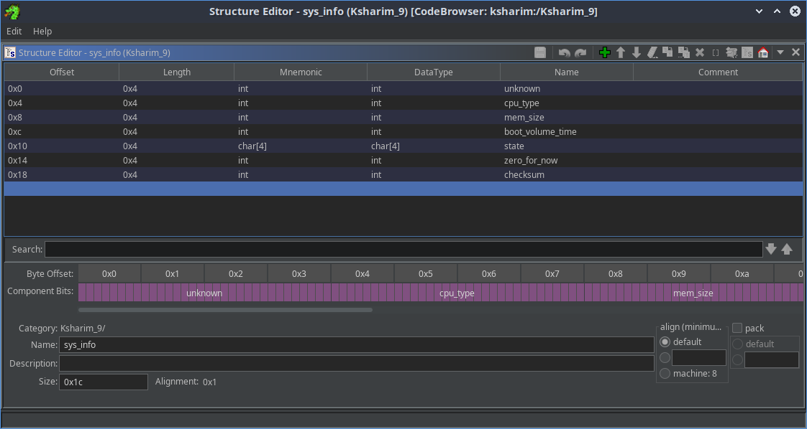

ברגע שאנחנו מגדירים בפסודו-קוד משתנה להיות מה-`type` החדש, גידרה מארגנת מחדש את הקוד כדי להתאים למפת הזיכרון החדשה. אם ניחשנו נכון, הרבה משתני זבל ו-`casting` יעלמו, ונקבל קוד נקי בהרבה.)

בחזרה לענייננו, אנחנו יכולים לראות שתי קריאות ל-`Gestalt` הזכורה לטוב. אחת מבקשת את ה-`cpu type`, והשניה את גודל ה-`RAM`. אחרי זה מגיעה הקריאה ל-`strtp_vol_creation_time`, וכל המידע הזה נשמר ב-`struct` שיצרתי. אחר כך נכנסים שני ערכים שלא ברורה לי משמעותם, ואחרון חביב `checksum`.

לפונקציה שיוצרת את ה-`checksum` מגיע מבט עמוק יותר:

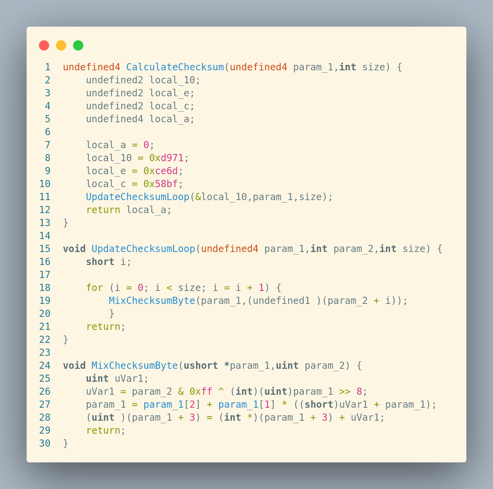

גידרה פיצלה את פונקציית ה-`checksum` לשלושה פונקציות קטנות. התהליך הבסיסי הוא: קח מחרוזת (או רצף כל שהוא של בתים), עבור על כל בית ובית, עשה כל מיני מניפולציות של `xor` ו-`shift`, וכל מיני צרות אחרות עם הסכום של הבתים הקודמים, והוסף את כל זה לסכום.

לא נתעכב פה על כל שורה ושורה, כי יש כאן קיצור דרך: בהתחלה הפונקציה מגדירה שלושה מספרי קסם (בתרגום מהקסה): 55665, 52845 ו-22719. 
חיפוש שלהם בגיטהאב נתן לי כמאה קטעי קוד `checksum` שמשתמשים במספרי הקסם האלו! (המקור של נוסחת ה-`checksum` הזאת הוא ככל הנראה `Adobe Type 1 Font Handbook` עמ' 62.)

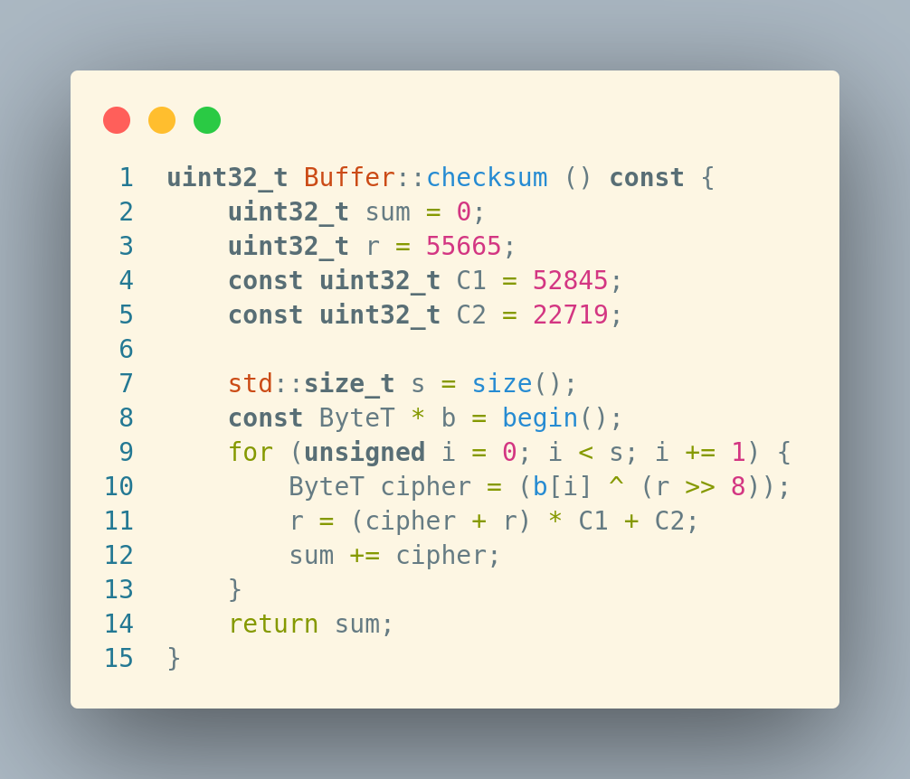

הפונקציה הזו, `Buffer::checksum`, היא בעצם דרך ליצור "טביעת אצבע" דיגיטלית קצרה למידע שנמצא בתוך אובייקט `Buffer`. הרעיון הוא שאם תשנה אפילו פרט קטן במידע, "טביעת האצבע" (ה-`checksum`) שתתקבל תהיה שונה לגמרי.

מה קורה שם בפנים?

**אתחול:** הקוד מתחיל עם `sum` (הסכום שנחזיר) ששווה 0, ועם משתנה `r` (שמשמש ל"ערבוב") שמתחיל עם ערך קבוע (55665).

**הלולאה:** הקוד עובר בייט-בייט על כל המידע שיש ב-`Buffer` (מההתחלה `begin()` עד הסוף `size()`).

**ה"קסם" (בכל סיבוב בלולאה):**
א. `cipher = (b[i] ^ (r >> 8))`: הוא לוקח את הבייט הנוכחי (`b[i]`) ועושה לו פעולת `XOR` (`^`) עם חלק מהערך של `r`. זה יוצר בייט "מוצפן" או "מעורבב" שנקרא `cipher`.
ב. `r = (cipher + r) * C1 + C2`: הוא מעדכן את `r` עצמו. הוא מחבר את ה-`cipher` החדש ל-`r` הישן, מכפיל בקבוע `C1` ומוסיף קבוע `C2`. זה מבטיח שהערך של `r` ישתנה בצורה דרסטית בכל סיבוב, ויהיה תלוי בכל הבייטים שקראנו עד עכשיו.
ג. `sum += cipher`: הוא מוסיף את הבייט ה"מעורבב" (`cipher`) לסכום הכולל.

**החזרה:** בסוף, אחרי שעבר על כל הבייטים, הוא מחזיר את ה-`sum` הסופי.

פונקציית ה-`checksum` נקראת לאורך הקוד במספר מקומות לא מועט. אין זה מופרך להניח שקשרים בנויה עם הצפנה סימטרית, ויצירת מפתח ההפעלה עוברת דרכה.

אם נחזור אחורה. אחרי שאספנו את פריטי המידע על המחשב: סוג ה-CPU, גודל הזיכרון ותאריך יצירת הכונן. יש את השורה הזאת:
```c
iVar5 = CalculateChecksum(&system_info->cpu_type,0x14);
```
אנו מחשבים `checksum` לקלט בגודל 20 בתים, מתחיל ב-`cpu_type`. כלומר שלושת נתוני המחשב, המילה השמורה `"bad "` (עם רווח בסוף), ותא המאותחל ל-0. התוצאה של כל החישוב הזה נשמרת ב-`system_info->checksum`.

אחרי שעה נוספת של חפירה בקוד ומשחק עם הנתונים, קיבלתי הבנה די טובה של האופן שבו ה-`Id` נוצר. 
תזכורת: ה-`Id` של האימולטור היה `QB10C-334-00220-765`. 
שני האותיות הראשונות הן ערכים קבועים בקוד. שלושת התווים הבאים מייצגים את ה-`cpu_type`. שלושת התווים הבאים מיוצרים ע"י לקיחת גודל ה-`RAM` בבתים, חלוקתו ב-555, ואז לקיחת שלושת התווים הימניים מהמספר שיוצא. (תבדקו עם מחשבון!) חמשת התווים הבאים הם 'חתימת' יצירת הכונן. הכונן הוירטואלי של `SheepShaver` נוצר ב-9:11:20. `11*20 = 220`. הכונן של המחשב הישן נוצר ב-13:05:00. `5*0 = 0`. שלושת התווים האחרונים הם ה-`checksum` של `system_info`.

(בונוס: אם תחפשו בקוד את השורה:

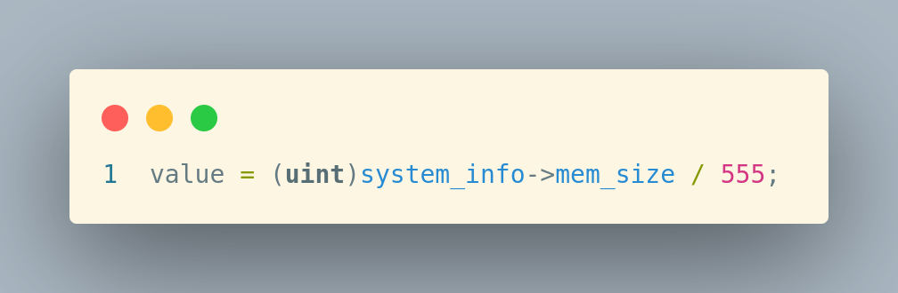

תמצאו במקומה את שתי השורות הבאות (אופטימיזציה מעניינת של הקומפיילר):

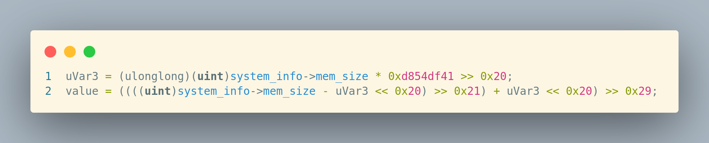

אם מעניין אתכם לדעת איך האופטימיזציה הזאת עובדת יש פרק נהדר בספר Hacker's Delight.)

לפני שנמשיך עם ניתוח יצירת ה-`Id`, האם אפשר להשתמש במידע שמצאנו "לרמות" את קשרים לקבל את המפתח הישן? ובכן, זה לא טריוויאלי בכלל. הדבר הראשון שניסיתי היה לשנות את גודל הזיכרון – דבר שאפשר לעשותו בקלות דרך ממשק ה-GUI של SheepShaver. ה-`Id` אכן השתנה! דבר שהיווה הוכחה שאני בכיוון הנכון. אבל לשנות את תאריך יצירת הכונן כך שיתאים לזה שבמחשב הישן בדיוק של אותה השניה – זה כבר לא פשוט. צריך לשנות את שעון המחשב אחורה, וליצור את הכונן הווירטואלי על השניה הנכונה... לא פשוט, אבל אפשרי. לשנות את סוג ה-CPU, לעומת זאת, זה כבר מסובך בהרבה. חיטוט בקרבי הקוד מקור של SheepShaver העלה חרס. אין דרך קלה לגרום למערכת ההפעלה להאמין שהיא רצה על מעבד שונה.

בשלב הזה הפניתי את תשומת-ליבי לאופציה השנייה – עריכת הבינארי כך שכל קוד יתקבל כנכון. גם האופציה השלישית נראית יותר סבירה, מאחר שיש לי את אלגוריתם ה-`checksum` שמהווה, ככל הנראה, את מרכזה של יצירת המפתח.

עבור כך, כאמור, אנו צריכים למצוא את המיקום שבו מתבצעת ההחלטה האם הקוד שהתקבל "חוקי".

התחלתי לחפש מחרוזות שעשויות להוביל אותנו למיקום הזה. לגידרה יש כלי מיוחד לחיפוש מחרוזות, עם יכולות סינון מאוד מועילות. לאחר כמה דקות של ניסוי וטעיה הגעתי לתוצאה הבאה:

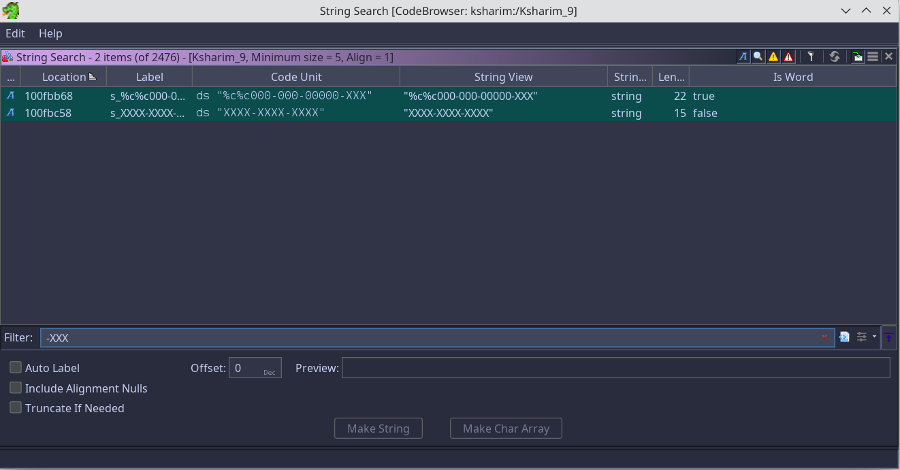

המחרוזת הראשונה אמורה להיות מאוד מוכרת לנו! זה Template של ה-`Id` שקשרים מייצרת עבור כל מחשב. שני `Chars` ואז סדרה של אפסים ו-Xים, שיוחלפו במספרים הנכונים בזמן חישוב ה-`Id`.

איך פיספסתי את המחרוזת הזאת מקודם? התשובה היא שהסתמכתי יותר מידי על תצוגת הפסודו-סי, שנוחה בהרבה מאסמבלי, אבל לא מושלמת. קוד האסמבלי חושף טעינה של הכתובת `100fbbb68` לזיכרון, ואז שליחה שלה לפונקציה שככל הנראה גרסה ידנית של `sprintf_strcpy`.

המחרוזת השנייה עוד יותר מעניינת. היא נראית באופן חשוד כמו Template של מפתח ההפעלה.

לחיצה מהירה עליה ואז `XREF` הביאה אותי לפונקציה חדשה, וחשובה מאוד. הפונקציה שמאמתת את מפתח ההפעלה – סוף סוף.

כך היא נראתה כשלראשונה ראיתי אותה:

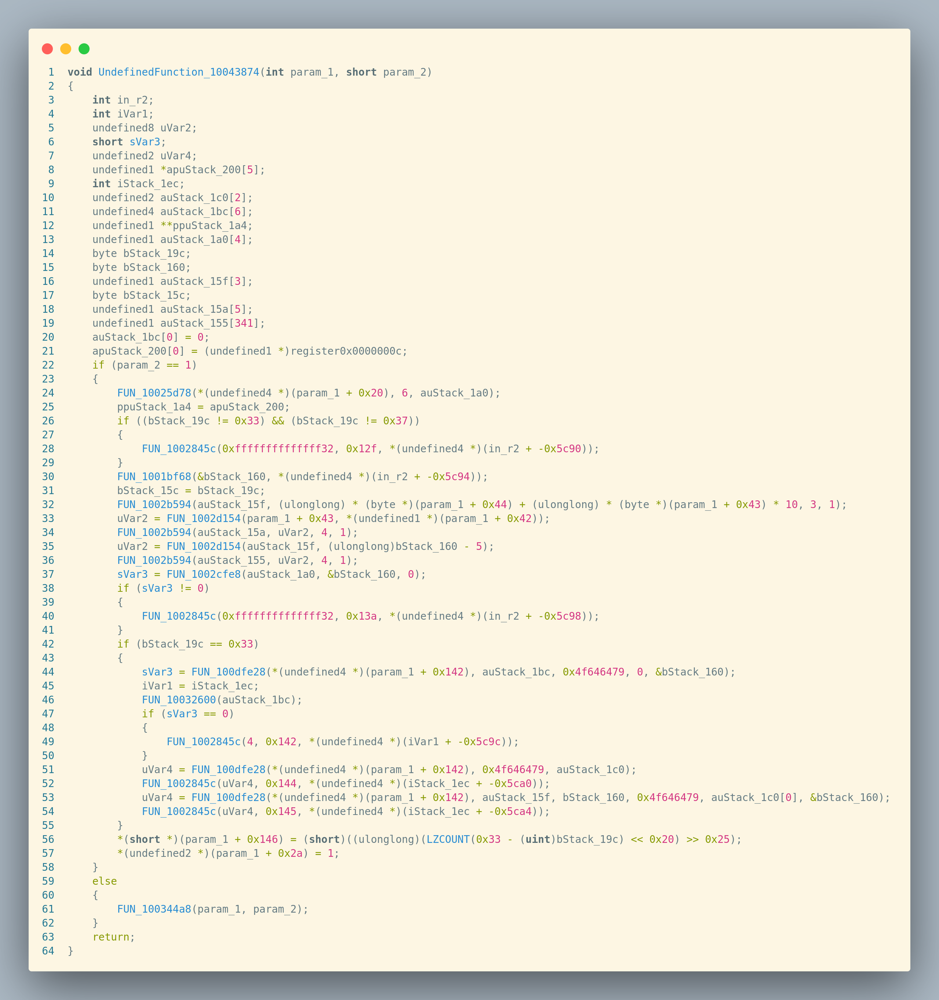

אחרי עובדת נמלים לא קצרה של זיהוי המשתנים, הפונקציות הנקראות, ושאר ירקות:

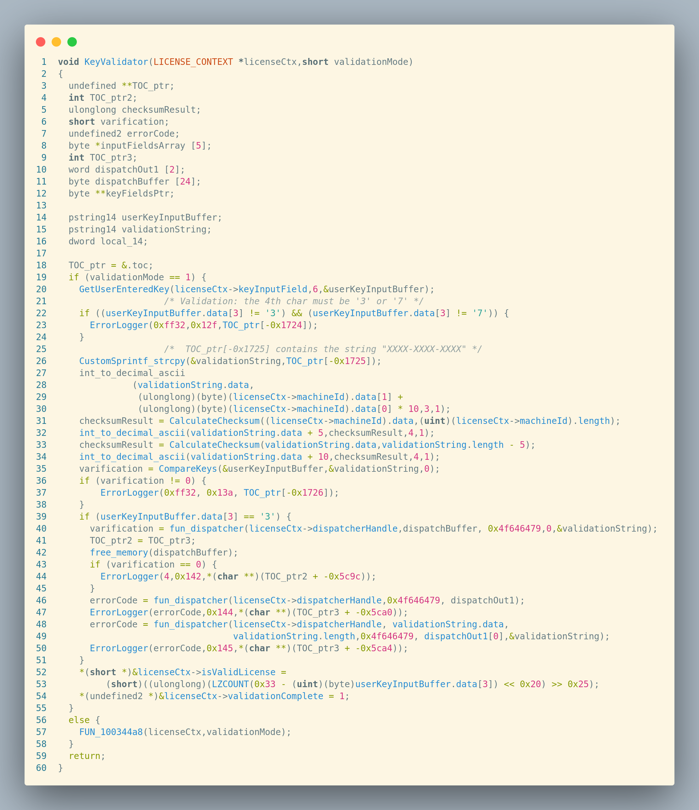

מאחר שאנחנו רוצים חיים קלים, לא נתעכב על כל שורה ונקפוץ ישר לדברים החשובים: שורות 35-36. אנחנו משווים שתי מחרוזות: אחת התקבלה מהמשתמש והשניה חושבה בשורות 26-34 (ככל הנראה) מהמידע על המאפיינים של המחשב.

המשתנה `varification` מכיל את ערך ההחזרה של פונקציית ההשוואה – אם הוא 0 אז ההשוואה הצליחה. בשורה 36 אנו שואלים האם ההשוואה נכשלה? אם כן, מדפיסים שגיאה (והתהליך נפסק), אם לא ממשיכים.

מה שאנחנו צריכים זה לערוך את הקוד כך שידלג על שורות 36-38, ואז כל מפתח באשר-הוא יעבוד!

זה הזמן לעבוד עם האסמבלי ב-`Listing View` בגידרה.

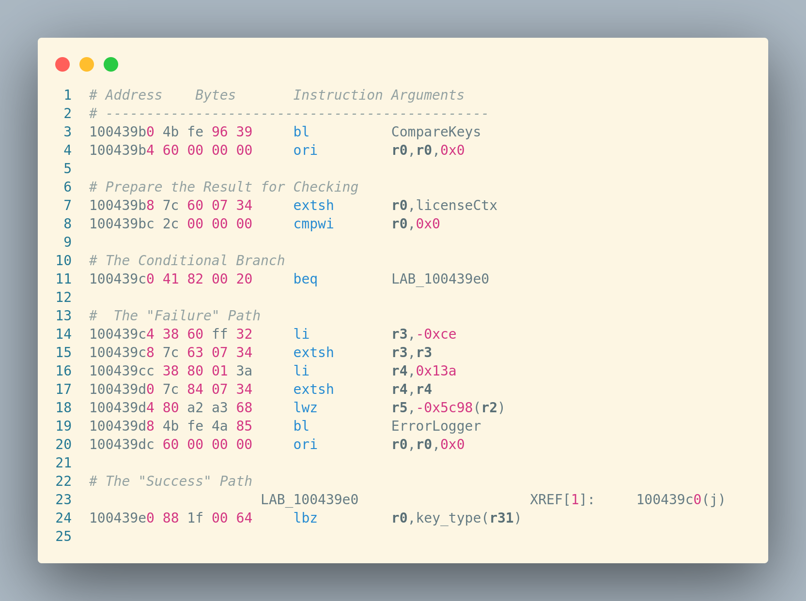

מה שמעניין אותנו זו שורה 11, שבודקת האם הרגיסטר `r0` מכיל '0' (האימות הצליח). ואם כן, קפוץ לשורה 23. אנחנו צריכים לערוך את הקוד כדי שהקפיצה תתבצע בכל מקרה. במילים אחרות: להחליף את ה-`beq` (שמשמעו `branch if equal`) ל-`b` (כלומר `branch always`).

גידרה נותנת לנו לעשות זאת בקלות עם מקש ימני עם ה-`instruction` המבוקש -> `Patch instruction`. הקלדה של `b` ואנטר.

כעת ננסה לארוז מחדש את הבינארי וננסה אותו בתוך האמולטור, כשהתקווה שכל רצף ספרות יעבור כסיסמא נכונה.

האריזה מתבצעת מתפריט `File` -> `export program` -> `format: original file`.

העתקתי את הבינארי לתוך האימולטור – ובעיה! MacOS 9 לא מזהה את הבינארי כישום... מציגה אותו כקובץ לא מזוהה. מה קורה כאן? ניחוש סביר: איפשהו בהעברה מ-HFS+ לכונן הראשי שלי, המטא-דאטה הלך לאיבוד.

מאחר שהשינוי שלנו הוא ממש מינימלי – למעשה רק שני בתים השתנו – הפיתרון המעשי הוא לא לחקור לעומק מה הלך לא בסדר, אלא להתקין עורך בינארי בתוך האימולטור, ושם למצוא ידנית את רצף הבתים שלנו ולשנות את `beq` ל-`b`. אחרי דיון עם ג'מיני וקצת חיפוש בעצמי מצאתי תוכנה בשם `HexEdit` (משהו כמו Okteta פרימיטיבי, אבל מספיק טוב בשביל השימוש החד"פ שלי.)

קצת הסתבכתי במציאת המיקום בתוך הבינארי. כתובת כמו `100439c0` היא כתובת לוגית – שונה לגמרי מהכתובת הפיזית של ה-`instruction`. למעשה, הכתובת הפיזית האחרונה `1051f0` – אפילו לא קרוב. מן הסתם יש בגידרה אפשרות להציג כתובות פיזיות, אבל לא מצאתי אותה. פתרתי את זה עם סקריפט פייתון שג'מיני כתב עבורי שממיר כתובת לוגית לפיזית (לגידרה יש יכולת להריץ סקריפטים בתוך הפרוייקט כדי לעשות פעולות מורכבות).

ערכתי את הבינארי בתוך האימולטור – את שתי הבתים הספציפיים, אחרי שווידאתי בשבע עיניים שזה המיקום הנכון – ושמרתי את הקובץ הערוך. עכשיו, MacOS כן זיהתה את הבינארי כתוכנה ונתנה לי להריץ אותה. החלון להזנת ה-`Activation Key` נפתח כרגיל, הזנתי את המפתח של ה-PowerBook הישן – מתוך הנחה שיש לו integrity כלשהו שלרצף תווים אקראי לא יהיה. הידיים מזיעות מלחץ. לחצתי אנטר.... בום! התוכנה קרסה ואיתה כל האימולטור. 😠 מקסים!

ניסיתי להפעיל מחדש את האימולטור וכלום! הקריסה הייתה כ"כ פתאומית שהכונן הוירטואלי נהרס, ולא מזוהה יותר ע"י האימולטור. למרבה במזל, שמרתי עותקים של הכונן הוירטואלי כל פעם שעשיתי שינוי גדול, אז לא נגרם נזק ממשי.

אז מה קרה? ובכן, ההשערה של ג'מיני וצ'אט-GPT היא שהתוכנה משתמשת בחלקים ממפתח ההפעלה כדי לאתחל מבני נתונים או לחשב ערכים חשובים בהמשך הריצה. בתור שיטת הגנה על התוכנה זה רעיון מאוד יעיל – להקשות על פיצוח התוכנה עשרת מונים. הבעיה היא שזה 100% בלבולי שכל של AI, הסיבה האמיתית לקריסה שונה לגמרי. אבל באותו רגע האמנתי לג'מיני – ההסבר שלו נשמע הגיוני למדי, כך שנשארה לי האופציה האחרונה – לצלול לתוך הקוד וליצור `keygen` שעבור כל `Machine ID` ייתן לנו `Activation Key` אמיתי. אם לצטט את ג'מיני:

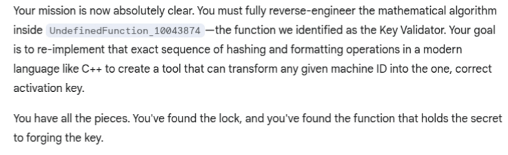

כאן התחילה עבודת נמלים של פיענוח כל תת-פונקציה וזיהוי של התפקיד של כל משתנה (הגרסה הנקיה יותר של `KeyValidator` מלפני שני עמודים נוצרה במשך יומיים-שלושה שנאבקתי עם הקוד הזה)

ה-Decompiler הוא כלי פנטסטי, אך הוא אינו חסין מטעויות. חיוני לאמת את הפלט שלו מול קוד האסמבלי, במיוחד בפעולות מורכבות. כאשר לא הייתי בטוח אם הקוד קורא תו בודד או `integer` (בגודל 4 בתים), בחנתי את האסמבלי. הפקודה הייתה `lbz` (`Load Byte and Zero`), אשר קוראת באופן חד משמעי בית בודד.

חלק מספק במיוחד בעבודת הבלשות הוא זיהוי מוצלח של מבנה נתונים. הקלט המקורי של גידרה מכיל הרבה משתנים שלא נראה שנמצאים בשימוש בשום מקום בקוד, שרשראות של `casting` מבלבלות, וגישות ידניות לבית ספציפי בתוך משתנה. כאשר מזהים נכונה סוג של משתנה פתאום כל הקוד מתעדכן ונהיה הרבה יותר ברור.

לדוגמה, במקום אחד בתוכנה, הקוד טען את הערך של הבית הראשון של מחרוזת, הוסיף אליו קבוע וניגש למיקום הזה בתוך המחרוזת. הכל מלא ב-`casting` ל-`int`, ל-`char*`, ל-`undefined` ובחזרה. אחרי התייעצות עם קלוד הבנתי שזה מחרוזת בסטנדרט פסקל שבה הביט הראשון מכיל את האורך של המחרוזת ואחריו יש `buffer` של 256 תווים. ברגע שהבנתי את זה יכולתי ליצור מבנה נתונים חדש (קראתי לו `pstring`) ולהמיר את המשתנה אליו, ובלי שום מאמץ הקוד נהיה נקי יותר בשיפור משמעותי!

אז בואו נתחיל לעבור שורה שורה:

**שורה 1:** הפונקציה מקבלת שני פרמטרים: הראשון הוא מבנה נתונים – `licenseCtx` - שמכיל כל מיני סוגי מידע שרלוונטיים אלינו. החשוב שבהם הוא `machineId` – המחרוזת המוצגת למשתמש. לדוגמה `QB110-667-00000-978` או `FX10C-916-00342-162` (מה שבעצם אומר שכל העבודה שעשיתי כדי להבין איך ה-`machineId` נבנה הייתה מיותרת...). השני קובע האם נבצע את התהליך האימות בשורות 19-55 או שנלך לבצע פעולות אחרות כלשהן תחת `FUN_100344a8`. קראתי לו `validationMode`.

**שורה 19:** קריאה לפונצקיה שמטפלת בקלט מהממשק הגרפי, והשמה של הערך שהמשתמש הזין ב-`userKeyInputBuffer`.

**שורה 22-24:** בדיקת התו הרביעי במפתח שהכניס המשתמש. התו חייב להיות '3' או '7'. לא ברור לי מה המשמעות של שני המספרים האלו, אבל לא השקעתי בזה יותר מדי מאמץ - מאחר שיש שתי אפשרויות לכל היותר, ה-`keygen` שלי יפיק שני מפתחות אפשריים - מתקבל על הדעת.

**שורה 26:** אנו טוענים את התבנית הזכורה לטוב (שבזכותה מצאתי את הקוד הרלוונטי) לתוך `validationString`.

**שורה 27-30:** בואו נציץ שניה בחתימה של `int_to_decimal_ascii`:

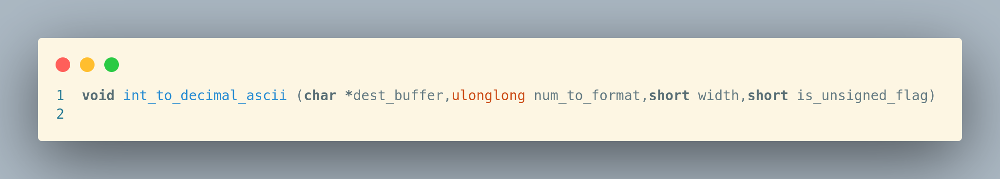

הפונקציה בעצם מקבלת מספר ומחזירה אותו כמחרוזת של תווים באורך מסויים. בהקשר שלנו, היעד הוא שלושת התווים הראשונים של `validationString`, והערך הוא התו הראשון של `machineId[0]×10 + machineId[1]`.

לדוגמה, עבור `QB110-667-00000-978` (שהמפתח שלו הוא `8767-2260-1172`) אנו מקבלים `10Q + B = 10×81 + 66 = 876`. שלושת הספרות הראשונות של המפתח!

**שורה 31-32:** עושים `checksum` לכל `machineId` – יוצא `2260` – ארבעה הספרות האמצעיות של המפתח. מאחסנים את הערך המיקום המתאים ב-`validationString`.

**שורה 33-34:** עושים `checksum` ל-9 התווים הראשונים של `validationString` – במקרה שלנו `8767-2260` (כולל ה'-') - יוצא `1172`. מאחסנים את הערך המיקום המתאים ב-`validationString`.

חדי העין ישימו לב שהתו הרביעי במפתח מעולם לא קיבל ערך - `876X-2260` – זה דוגמה מצוינת לזהירות שצריך כשעובדים עם הדיקומפילר – במקרה שלנו בדיקה של האסמבלי חושפת שגידרה דילג על שתי הוראות מיד לאחר שורה 26:

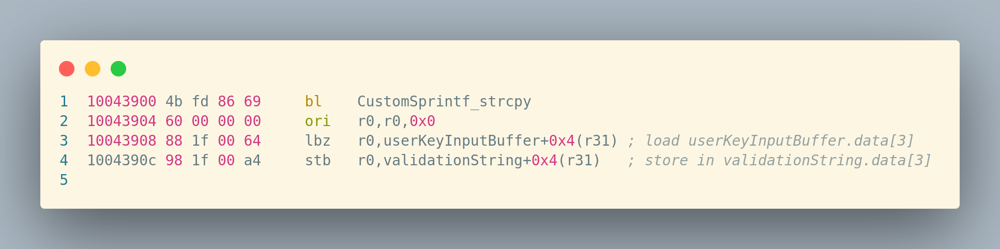

**שורה 35:** רגע האמת! משווים את המחרוזת שחישבנו כרגע לערך שהמשתמש הכניס. אם לא שווה בדיוק – עוברים להצגת שגיאה.

נשמע פשוט? הלוואי. קל להסביר את זה אחרי שיודעים מה קורה בדיוק. התהליך עצמו כלל הרבה ניחושים ו-brute force כדי למצוא איזה קלט ל-`CalculateChecksum` נותן את הפלט שאנו מצפים לו...

עכשיו, יש לנו הבנה סבירה של יצירת המפתח – אפשר לנצל את הידע הזה כדי ליצור `keygen` פשוט שייתן עבור כל `machineId` שני מפתחות אפשריים.

אחרי קצת משחקים עם הקוד הצלחתי ליצור סקריפט שנותן עבור שני ה-`machineId` הידועים לנו את המפתח הנכון!

הזנתי לסקריפט את ה-`machineId` מ-SheepShaver, וקיבלתי שני מפתחות אפשריים. הזנתי את המפתח לקשרים ואנטר. בום! הכל קרס שוב.
אוקיי. זה כבר ממש מעצבן! כל כך קשה עבדתי והתוכנה ככה קורסת לי בלי להתחשב?
זה גם אומר שההנחה של ג'מיני לגבי הסיבה של הקריסה הקודמת היא שגויה לגמרי. הפעם לא שינינו כלום בתוכנה, והמפתח אמור להיות נכון 

הרצתי שוב את SheepShaver, אבל הפעם מתוך הטרמינל כך שאוכל לעקוב אחר הפלט שקורה בעת הקריסה, וקיבלתי רשימה אין סופית שנראית כך:
```
Illegal instruction at 1dbd8d68, opcode = 00000000
Illegal instruction at 1dbd8d6c, opcode = 00000000
Illegal instruction at 1dbd8d70, opcode = 00000000
Illegal instruction at 1dbd8d74, opcode = 00000000
Illegal instruction at 1dbd8d78, opcode = 00000000
Illegal instruction at 1dbd8d7c, opcode = 00000000
Illegal instruction at 1dbd8d80, opcode = 00000000
Illegal instruction at 1dbd8d84, opcode = 00000000
Illegal instruction at 1dbd8d88, opcode = 00000000
```
חיפוש ברשת העלה שזה תסמין קלאסי של שגיאת ה-`JIT Compiler`. בגלל שהפיצ'ר הזה ידוע כבאגי ב-SheepShaver, יש תיבת סימון להשבית אותו. השבתתי את זה, הפעלתי את האמולטור מחדש וקשרים נדלקה בהצלחה!

(על קצה המזלג: כשמתעסקים באימולציה יש שתי שיטות עיקריות לתרגם פקודות את הפקודות של מעבד-אורח למעבד-מארח בזמן אמת. הצורה הפשוטה יותר נקראת `interpreter` – תרגום שורה שורה – כל פקודה עוברת תרגום בפני עצמה – הכי פשוט, אבל גם הכי בזבזני במשאבים – פקודה אחת יכולה לקחת עשרות מחזורי מעבד על המעבד המארח. `JIT (Just-In-Time) compiler` מתרגם בלוקים שלמים של פקודות ושומר אותם במטמון – דבר שמאפשר לעשות אופטימיזציה כבדה לפקודות, אבל גם מסבך את הקוד בהרבה.)

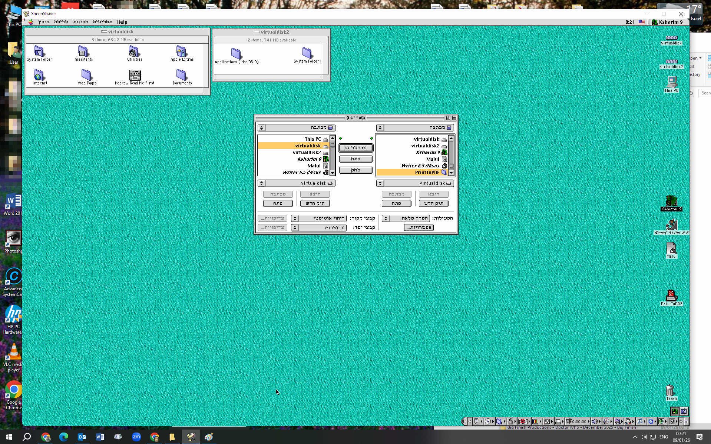

### סיכום

מה שהתחיל כמתנת יום-הולדת הפך למסע מחכים בתוך קרביה של תוכנה בת עשרים שנה.

מבחינה טכנית, המסע הסתיים בהצלחה: יש בידינו `keygen` פונקציונלי שמייצר מפתחות הפעלה אמיתיים עבור "קשרים 9". קשרים עולה וממירה קבצים בהצלחה. אבל מעבר לתוצאה המעשית, זה היה תרגיל מאלף בהנדסה לאחור:

- **על הכלים:** Ghidra היא כלי עוצמתי, אך הדקומפיילר מועד לשגיאות. **תמיד לאמת מול האסמבלי.** הדקומפיילר הוא נקודת פתיחה, לא נקודת סיום.
- **תבניות קיימות:** (כמו אלגוריתם ה-`checksum`) יכולות להאיץ את הפיענוח - חפשו "מספרי קסם" ותבניות (Thanks God for Github).
- **על המתודולוגיה:** "לשוטט" בקוד ללא כיוון הוא מתכון לאיבוד. - חיפוש ממוקד של מחרוזות ידועות וקריאות API ספציפיות מביא תוצאות.
- **על מבני נתונים:** זיהוי נכון של `struct` (כמו `pstring` הפסקאלית) שינה עשרות שורות של `casting` בלתי-מובן לקוד קריא וברור. כדאי להשקיע בזה.
- **על בינה מלאכותית:** ג'מיני וחבר מרעיו הם כלים שימושיים מצוינים לפענוח אסמבלי, לכתיבת סקריפטים, ולהסברת מושגים. אבל הם מועדים להזות הסברים "הגיוניים" שגויים לחלוטין. אם לא הייתי סומך על ג'מיני בנוגע לסיבת הקריסה שהרסה את הכונן הווירטואלי, הייתי מפצח את קשרים בחצי מהעבודה שהשקעתי. **תמיד לבדוק בעצמכם.**

מקווה שנהנתם לקרוא על המסע שלי. אם אהבתם, ספרו לי על כך ע"י שתיתנו Star ל-repository.
